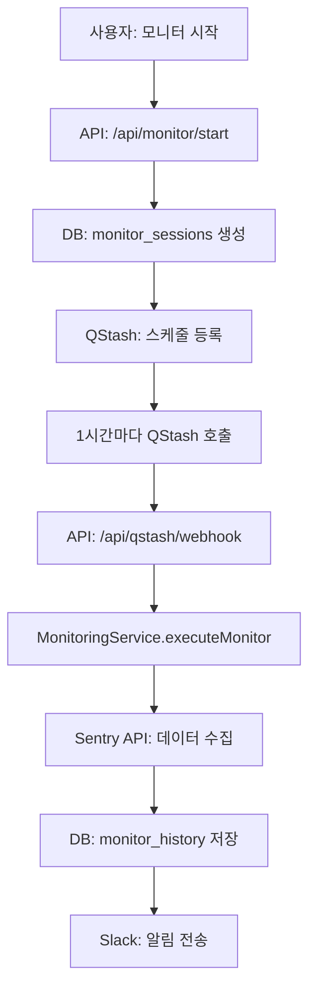
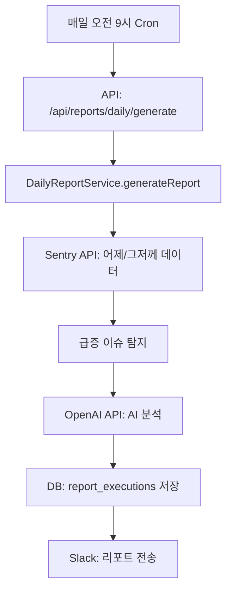

# Sentry Crash Report Monitor - 프로젝트 개요

## 📋 목차
- [프로젝트 소개](#-프로젝트-소개)
- [기술 스택](#-기술-스택)
- [시스템 아키텍처](#-시스템-아키텍처)
- [주요 기능](#-주요-기능)
  - [1. 릴리즈 모니터링](#1-릴리즈-모니터링)
  - [2. 일간 리포트](#2-일간-리포트)
  - [3. 주간 리포트](#3-주간-리포트)
  - [4. Sentry 이슈 분석](#4-sentry-이슈-분석)
  - [5. 대시보드](#5-대시보드)
- [데이터베이스 스키마](#-데이터베이스-스키마)
- [환경 변수 설정](#-환경-변수-설정)
- [배포 및 스케줄링](#-배포-및-스케줄링)

---

## 🎯 프로젝트 소개

**Sentry Crash Report Monitor**는 Sentry API를 활용하여 모바일 앱(Android/iOS)의 크래시 및 에러를 모니터링하고, 자동으로 리포트를 생성하여 Slack으로 전송하는 Next.js 기반 웹 애플리케이션입니다.

### 핵심 가치
- **실시간 릴리즈 모니터링**: 새로운 앱 릴리즈 배포 후 30분~1시간 간격으로 크래시 발생 현황을 자동 추적
- **AI 기반 인사이트**: OpenAI API를 활용한 크래시 패턴 분석 및 액션 아이템 제안
- **통계 기반 이상 탐지**: Z-Score, MAD(Median Absolute Deviation) 등을 활용한 급증 이슈 자동 탐지
- **자동화된 리포팅**: 일간/주간 리포트를 자동 생성하여 Slack으로 전송

---

## 🛠 기술 스택

### Frontend
- **Next.js 15.5.2** (App Router)
- **React 19.1.0**
- **TypeScript 5**
- **Mantine UI 8.3.1** (UI 컴포넌트 라이브러리)
- **Recharts 3.2.1** (데이터 시각화)

### Backend & Database
- **Supabase** (PostgreSQL 데이터베이스 + Auth)
- **Next.js API Routes** (서버리스 API)

### 외부 API & Services
- **Sentry API** (크래시/에러 데이터)
- **OpenAI API (GPT-4o-mini)** (AI 분석)
- **Slack Webhook API** (알림 전송)
- **Upstash QStash** (스케줄링 - cron job)

### 개발 도구
- **date-fns** (날짜 처리)
- **zod** (스키마 검증)
- **uuid** (고유 ID 생성)

---

## 🏗 시스템 아키텍처

```
┌─────────────────────────────────────────────────────────────┐
│                        Next.js App                          │
│  ┌───────────────────────────────────────────────────────┐  │
│  │              Frontend (React + Mantine)               │  │
│  │  - 대시보드                                            │  │
│  │  - 일간/주간 리포트 뷰어                               │  │
│  │  - 모니터링 설정 UI                                    │  │
│  └───────────────────────────────────────────────────────┘  │
│                           ↕                                 │
│  ┌───────────────────────────────────────────────────────┐  │
│  │            API Routes (Serverless)                    │  │
│  │  - /api/monitor/*     (릴리즈 모니터링)               │  │
│  │  - /api/reports/*     (일간/주간 리포트)              │  │
│  │  - /api/sentry/*      (Sentry 데이터 조회)            │  │
│  │  - /api/qstash/*      (Webhook 수신)                  │  │
│  └───────────────────────────────────────────────────────┘  │
│                           ↕                                 │
│  ┌───────────────────────────────────────────────────────┐  │
│  │              Service Layer                            │  │
│  │  - MonitoringService   (모니터 실행 로직)             │  │
│  │  - DailyReportService  (일간 리포트)                  │  │
│  │  - WeeklyReportService (주간 리포트)                  │  │
│  │  - SentryService       (Sentry API 클라이언트)        │  │
│  │  - SlackService        (Slack 메시지 전송)            │  │
│  │  - AIAnalysisService   (AI 분석)                      │  │
│  └───────────────────────────────────────────────────────┘  │
└─────────────────────────────────────────────────────────────┘
                           ↕
    ┌──────────────────────────────────────────────┐
    │        External Services                     │
    │  - Supabase (Database)                       │
    │  - Sentry API (Crash Data)                   │
    │  - OpenAI API (AI Analysis)                  │
    │  - Slack Webhook (Notifications)             │
    │  - Upstash QStash (Cron Scheduling)          │
    └──────────────────────────────────────────────┘
```

### 데이터 흐름

1. **모니터링 시작**: 사용자가 특정 릴리즈(예: `1.2.3`)에 대한 모니터링 시작
2. **스케줄 등록**: QStash에 30분 또는 1시간 간격으로 실행되는 cron job 등록
3. **주기적 실행**: QStash가 `/api/qstash/webhook` 엔드포인트 호출
4. **데이터 수집**: Sentry API로부터 크래시/에러 데이터 수집
5. **분석 & 저장**: 데이터를 분석하고 Supabase에 히스토리 저장
6. **알림 전송**: Slack으로 요약 리포트 전송

---

## 🎨 주요 기능

### 1. 릴리즈 모니터링

특정 앱 릴리즈 버전의 크래시를 실시간으로 추적하는 핵심 기능입니다.

#### 주요 특징
- **자동 릴리즈 매칭**: 베이스 버전(예: `1.2.3`)을 입력하면 Sentry에서 전체 버전(예: `1.2.3+456`) 자동 검색
- **스마트 스케줄링**:
  - 모든 기간: **1시간 간격** 실행 (통일)
  - 테스트 모드: 1~60분 사이 커스텀 간격 설정 가능
- **델타 추적**: 이전 실행 대비 변화량(증감) 자동 계산
- **Top 5 이슈**: 가장 많이 발생한 이슈 자동 추출

#### 구현 세부사항

**주요 파일**:
- `src/lib/monitor.ts`: 모니터링 실행 로직
- `src/lib/scheduler.ts`: 스케줄링 로직
- `src/api/monitor/start/route.ts`: 모니터 시작 API
- `src/api/monitor/tick/route.ts`: 주기적 실행 엔드포인트

**핵심 로직** (`MonitoringService.executeMonitor`):
```typescript
1. 마지막 실행 시간 조회
2. 실행 조건 확인 (1시간 경과 여부)
3. 릴리즈 버전 매칭 (matched_release)
4. 시간 윈도우 계산 (windowStart ~ windowEnd)
5. Sentry에서 집계 데이터 수집
   - 이벤트 수 (crash_events)
   - 유니크 이슈 수 (unique_issues)
   - 영향 받은 사용자 수 (impacted_users)
6. Top 5 이슈 조회
7. 델타 계산 (이전 실행 대비)
8. Slack 알림 전송
9. 히스토리 저장 (Supabase)
```

**Slack 메시지 형식**:
```
🚀 릴리즈 모니터링 — ANDROID 1.2.3+456
집계 구간: 2024-01-15 10:00 ~ 2024-01-15 11:00 (KST) · 주기: 1시간

📊 스냅샷 요약
• 💥 총 이벤트: 1,234건 · 최근 1시간 123건 (🔺 +15건)
• 🐞 총 유니크 이슈: 45개 · 최근 1시간 5개 (🔻 -2개)
• 👥 총 영향 사용자: 890명 · 최근 1시간 89명 (🔺 +10명)

🏅 윈도우 Top5 이슈
• NullPointerException in MainActivity.onCreate · 45건 · 23명
• IndexOutOfBoundsException in RecyclerView · 32건 · 18명
...
```

---

### 2. 일간 리포트

전일(어제) 발생한 크래시를 분석하여 일간 리포트를 생성합니다.

#### 주요 특징
- **KST 기준 집계**: 한국 시간 기준으로 어제 00:00 ~ 23:59 집계
- **전일 대비 분석**: 그저께 데이터와 비교하여 증감률 표시
- **AI 코멘트**: OpenAI GPT-4o-mini를 활용한 인사이트 제공
- **급증 이슈 탐지**: 통계 기반(Z-Score, MAD) 알고리즘으로 이상 급증 감지

#### 구현 세부사항

**주요 파일**:
- `src/lib/reports/daily-report.ts`: 일간 리포트 서비스
- `src/lib/reports/ai-analysis.ts`: AI 분석 로직
- `src/api/reports/daily/generate/route.ts`: 리포트 생성 API

**급증 탐지 알고리즘** (`detectSurgeIssuesAdvanced`):
```typescript
// Python 스크립트와 동일한 파라미터
const SURGE_MIN_COUNT = 30           // 최소 이벤트 건수
const SURGE_GROWTH_MULTIPLIER = 2.0  // 전일 대비 2배 이상
const SURGE_Z_THRESHOLD = 2.0        // Z-Score 2.0 이상
const SURGE_MAD_THRESHOLD = 3.5      // MAD Score 3.5 이상
const BASELINE_DAYS = 7              // 베이스라인: 최근 7일

// 판정 조건 (하나라도 만족 시 급증)
1. growth: 전일 대비 2배 이상 증가
2. zscore: 7일 평균 대비 통계적으로 유의미한 급증 (Z ≥ 2.0)
3. madscore: 7일 중앙값 대비 이상치 (MAD ≥ 3.5)
4. new_burst: 최근 7일간 거의 없던 이슈가 갑자기 15건 이상 발생
```

**AI 분석 프롬프트 구조**:
```typescript
- 역할: "Sentry 오류 리포트를 분석하는 친근한 AI 코치"
- 입력 데이터:
  * 어제/그저께 Summary (이벤트, 이슈, 사용자 수, Crash Free 비율)
  * Top 5 이슈 목록
  * 신규 이슈 목록
  * 급증 이슈 목록

- 출력 형식 (JSON):
  {
    "newsletter_summary": "하루 요약 (1-2문장)",
    "today_actions": [
      {
        "title": "액션 제목",
        "why": "필요한 이유",
        "owner_role": "담당자 (예: Backend팀)",
        "suggestion": "구체적 제안"
      }
    ],
    "per_issue_notes": [
      {
        "issue_title": "이슈 제목 (원문 그대로)",
        "note": "개별 코멘트"
      }
    ]
  }
```

**리포트 구성** (14단계):
```
[1/14] 환경 변수 로드
[2/14] 날짜 계산 (어제, 그저께 KST 기준)
[3/14] 프로젝트 ID 확인
[4/14] 어제 집계 수집 (이벤트, 이슈, 사용자)
[5/14] 어제 Crash Free 비율 수집
[6/14] 어제 Top 5 이슈 수집
[7/14] 어제 신규 이슈 수집
[8/14] 어제 급증 이슈 탐지
[9/14] 그저께 집계 수집
[10/14] 그저께 Crash Free 비율 수집
[11/14] 리포트 데이터 구성
[12/14] AI 코멘트 생성
[13/14] Slack 블록 구축
[14/14] Slack 전송
```

---

### 3. 주간 리포트

지난 주(월~일) 크래시를 종합 분석하여 주간 리포트를 생성합니다.

#### 주요 특징
- **주 단위 집계**: 지난주 월요일 00:00 ~ 일요일 23:59 (KST)
- **전주 대비**: 지지난주 데이터와 비교
- **신규 이슈**: 주간 처음 발생한 이슈 목록
- **급증 이슈**: 전주 대비 급증한 이슈 (주간 버전 알고리즘)
- **릴리즈 개선 분석**: 최신 릴리즈에서 해소된 이슈 자동 탐지

#### 구현 세부사항

**주요 파일**:
- `src/lib/reports/weekly-report.ts`: 주간 리포트 서비스
- `src/api/reports/weekly/generate/route.ts`: 리포트 생성 API

**주간 급증 탐지** (`detectWeeklySurge`):
```typescript
const WEEKLY_SURGE_MIN_EVENTS = 50         // 최소 이벤트 건수
const WEEKLY_SURGE_GROWTH_MULTIPLIER = 2.0 // 전주 대비 2배 이상
const WEEKLY_BASELINE_WEEKS = 4            // 베이스라인: 최근 4주

// 베이스라인: 최근 4주 데이터로 평균/표준편차/중앙값/MAD 계산
// 판정 조건:
1. growth: 전주 대비 2배 이상
2. zscore: 4주 평균 대비 통계적 급증 (Z ≥ 2.0)
3. madscore: 4주 중앙값 대비 이상치 (MAD ≥ 3.5)
```

**릴리즈 개선 탐지** (`releaseFixesInWeek`):
```typescript
// 최신 semver 릴리즈를 기준으로 개선된 이슈 탐지
1. 최신 릴리즈 버전 선택 (semver 형식: x.y.z)
2. 주간 Top 50 이슈 선정
3. 각 이슈별 전/후 7일 비교
   - 전기간: 최신 릴리즈 배포 이전 7일
   - 후기간: 최신 릴리즈 배포 이후 7일
4. 판정:
   - disappeared: 전기간 발생했으나 후기간 0건 + 이슈 상태 'resolved'
   - decreased: 전기간 대비 80% 이상 감소
```

**리포트 구성** (13단계):
```
[1/13] 환경 로드
[2/13] 주간 범위 계산 (지난주, 지지난주)
[3/13] 프로젝트 ID 확인
[4/13] 주간 합계 집계 (이번주, 지지난주)
[5/13] Crash Free 주간 평균 계산
[6/13] 상위 이슈 수집 (Top 5)
[7/13] 신규 이슈 + 급증 이슈 탐지
[10~11/13] 릴리즈 목록 수집
[12/13] 최신 릴리즈 개선 분석
[13/13] Slack 전송
```

---

### 4. Sentry 이슈 분석

특정 Sentry 이슈에 대한 상세 분석 및 AI 기반 원인 파악 기능입니다.

#### 주요 특징
- **다양한 입력 형식 지원**:
  - Sentry URL: `https://finda-b2c.sentry.io/issues/4567891234/`
  - Issue ID: `4567891234`
  - Short ID: `FINDA-ANDROID-ABC`
- **AI 기반 분석**:
  - Stack Trace 분석
  - Breadcrumbs (사용자 행동 경로) 분석
  - 예상 원인 및 해결 방안 제시

**주요 파일**:
- `src/lib/sentry-api.ts`: Sentry API 클라이언트
- `src/app/monitor/sentry-analysis/page.tsx`: 분석 페이지

---

### 5. 대시보드

실시간 크래시 현황을 시각화하여 보여주는 대시보드입니다.

#### 주요 특징
- **플랫폼별 대시보드**: Android / iOS 분리
- **시계열 차트**: 시간대별 이벤트/이슈/사용자 수 추이
- **통계 카드**: 주요 지표 요약
- **최근 히스토리**: 최근 모니터링 실행 결과 목록

**주요 파일**:
- `src/app/monitor/dashboard/page.tsx`: 통합 대시보드
- `src/app/monitor/dashboard/android/page.tsx`: Android 대시보드
- `src/app/monitor/dashboard/ios/page.tsx`: iOS 대시보드
- `src/components/PlatformDashboard.tsx`: 대시보드 컴포넌트

---

## 💾 데이터베이스 스키마

Supabase (PostgreSQL)에서 관리하는 주요 테이블입니다.

### `monitor_sessions`
릴리즈 모니터링 세션 정보를 저장합니다.

```sql
CREATE TABLE monitor_sessions (
  id UUID PRIMARY KEY DEFAULT uuid_generate_v4(),
  platform VARCHAR NOT NULL,              -- 'android' | 'ios'
  base_release VARCHAR NOT NULL,          -- 베이스 릴리즈 (예: '1.2.3')
  matched_release VARCHAR,                -- 전체 릴리즈 (예: '1.2.3+456')
  status VARCHAR NOT NULL,                -- 'active' | 'stopped' | 'expired'
  started_at TIMESTAMPTZ NOT NULL,
  expires_at TIMESTAMPTZ NOT NULL,
  qstash_schedule_id VARCHAR,             -- QStash 스케줄 ID
  is_test_mode BOOLEAN DEFAULT FALSE,
  custom_interval_minutes INTEGER,        -- 테스트 모드용 커스텀 간격
  metadata JSONB,                         -- 추가 메타데이터
  created_at TIMESTAMPTZ DEFAULT NOW(),
  updated_at TIMESTAMPTZ DEFAULT NOW()
);
```

### `monitor_history`
모니터링 실행 히스토리를 저장합니다.

```sql
CREATE TABLE monitor_history (
  id UUID PRIMARY KEY DEFAULT uuid_generate_v4(),
  monitor_id UUID NOT NULL REFERENCES monitor_sessions(id),
  executed_at TIMESTAMPTZ DEFAULT NOW(),  -- 실행 시간
  window_start TIMESTAMPTZ NOT NULL,      -- 집계 시작 시간
  window_end TIMESTAMPTZ NOT NULL,        -- 집계 종료 시간
  events_count INTEGER NOT NULL,
  issues_count INTEGER NOT NULL,
  users_count INTEGER NOT NULL,
  top_issues JSONB,                       -- Top 5 이슈 JSON
  slack_sent BOOLEAN DEFAULT FALSE,
  created_at TIMESTAMPTZ DEFAULT NOW()
);
```

### `report_executions`
일간/주간 리포트 실행 기록을 저장합니다.

```sql
CREATE TABLE report_executions (
  id UUID PRIMARY KEY DEFAULT uuid_generate_v4(),
  report_type VARCHAR NOT NULL,           -- 'daily' | 'weekly'
  trigger_type VARCHAR NOT NULL,          -- 'scheduled' | 'manual'
  target_date DATE NOT NULL,
  period_start TIMESTAMPTZ NOT NULL,
  period_end TIMESTAMPTZ NOT NULL,
  platform VARCHAR NOT NULL,              -- 'android' | 'ios'
  status VARCHAR NOT NULL,                -- 'pending' | 'success' | 'error'
  report_data JSONB,                      -- 리포트 전체 데이터
  ai_analysis JSONB,                      -- AI 분석 결과
  slack_sent BOOLEAN DEFAULT FALSE,
  error_message TEXT,
  execution_time_ms INTEGER,              -- 실행 시간 (밀리초)
  logs TEXT[],                            -- 실행 로그
  created_at TIMESTAMPTZ DEFAULT NOW(),
  completed_at TIMESTAMPTZ
);
```

---

## 🔐 환경 변수 설정

`.env.local` 파일에 다음 환경 변수를 설정해야 합니다.

### 필수 공통 변수
```bash
# Sentry
SENTRY_AUTH_TOKEN=your_sentry_auth_token
SENTRY_ORG_SLUG=your_org_slug

# Supabase
NEXT_PUBLIC_SUPABASE_URL=https://your-project.supabase.co
NEXT_PUBLIC_SUPABASE_ANON_KEY=your_anon_key
SUPABASE_SERVICE_ROLE_KEY=your_service_role_key

# OpenAI (AI 분석 사용 시)
OPENAI_API_KEY=your_openai_api_key

# Upstash QStash (스케줄링)
QSTASH_TOKEN=your_qstash_token
QSTASH_CURRENT_SIGNING_KEY=your_signing_key
QSTASH_NEXT_SIGNING_KEY=your_next_signing_key
```

### Android 프로젝트 설정
```bash
ANDROID_PROJECT_SLUG=finda-android
ANDROID_PROJECT_ID=123456
ANDROID_SENTRY_ENVIRONMENT=production
ANDROID_DASHBOARD_URL=https://sentry.io/organizations/your-org/dashboard/123/

# Slack Webhooks
ANDROID_SLACK_WEBHOOK_URL=https://hooks.slack.com/services/...       # 운영 모니터링
ANDROID_SLACK_WEBHOOK_URL_TEST=https://hooks.slack.com/services/...  # 테스트 모니터링
ANDROID_SLACK_WEBHOOK_URL_REPORT=https://hooks.slack.com/services/... # 일간/주간 리포트
```

### iOS 프로젝트 설정
```bash
IOS_PROJECT_SLUG=finda-ios
IOS_PROJECT_ID=789012
IOS_SENTRY_ENVIRONMENT=production
IOS_DASHBOARD_URL=https://sentry.io/organizations/your-org/dashboard/456/

# Slack Webhooks
IOS_SLACK_WEBHOOK_URL=https://hooks.slack.com/services/...
IOS_SLACK_WEBHOOK_URL_TEST=https://hooks.slack.com/services/...
IOS_SLACK_WEBHOOK_URL_REPORT=https://hooks.slack.com/services/...
```

---

## 🚀 배포 및 스케줄링

### Vercel 배포
이 프로젝트는 Vercel에 배포되어 서버리스 환경에서 실행됩니다.

```bash
# 프로덕션 배포
npm run build
vercel --prod

# 환경 변수는 Vercel 대시보드에서 설정
```

### Upstash QStash 스케줄링
릴리즈 모니터링 및 일간/주간 리포트는 Upstash QStash를 통해 자동 실행됩니다.

#### 릴리즈 모니터링
- **모니터 시작** → QStash 스케줄 생성 (1시간 간격)
- **엔드포인트**: `POST https://your-domain.com/api/qstash/webhook`
- **Payload**: `{ monitorId: "uuid", customIntervalMinutes: 60 }`

#### 일간 리포트
- **스케줄**: 매일 오전 9시 (KST)
- **Cron**: `0 0 * * *` (UTC 기준, KST -9시간)
- **엔드포인트**: `POST https://your-domain.com/api/reports/daily/generate`

#### 주간 리포트
- **스케줄**: 매주 월요일 오전 10시 (KST)
- **Cron**: `0 1 * * 1` (UTC 기준)
- **엔드포인트**: `POST https://your-domain.com/api/reports/weekly/generate`

---

## 📂 주요 디렉토리 구조

```
monitor/
├── src/
│   ├── app/                          # Next.js App Router
│   │   ├── api/                      # API Routes
│   │   │   ├── monitor/              # 릴리즈 모니터링 API
│   │   │   ├── reports/              # 리포트 API
│   │   │   ├── sentry/               # Sentry 데이터 조회 API
│   │   │   └── qstash/               # QStash Webhook
│   │   └── monitor/                  # 프론트엔드 페이지
│   │       ├── dashboard/            # 대시보드
│   │       ├── daily/                # 일간 리포트 뷰어
│   │       ├── weekly/               # 주간 리포트 뷰어
│   │       ├── history/              # 히스토리
│   │       ├── sentry-analysis/      # Sentry 이슈 분석
│   │       └── settings/             # 설정
│   ├── lib/                          # 핵심 로직
│   │   ├── monitor.ts                # 모니터링 서비스
│   │   ├── scheduler.ts              # 스케줄링 로직
│   │   ├── sentry.ts                 # Sentry API 클라이언트
│   │   ├── slack.ts                  # Slack 메시지 전송
│   │   ├── database.ts               # Supabase DB 접근
│   │   ├── reports/                  # 리포트 관련
│   │   │   ├── daily-report.ts       # 일간 리포트
│   │   │   ├── weekly-report.ts      # 주간 리포트
│   │   │   └── ai-analysis.ts        # AI 분석
│   │   └── types.ts                  # TypeScript 타입 정의
│   └── components/                   # React 컴포넌트
│       ├── DashboardShell.tsx        # 대시보드 레이아웃
│       ├── PlatformDashboard.tsx     # 플랫폼 대시보드
│       ├── DailyReportComponent.tsx  # 일간 리포트 컴포넌트
│       └── WeeklyReportComponent.tsx # 주간 리포트 컴포넌트
├── package.json
└── tsconfig.json
```

---

## 🔄 주요 워크플로우

### 릴리즈 모니터링 워크플로우


### 일간 리포트 워크플로우


---

## 📊 핵심 알고리즘

### 1. Z-Score 기반 급증 탐지
```typescript
// 평균과 표준편차를 사용한 이상치 탐지
const mean = sum(baselineValues) / count
const std = sqrt(sum((value - mean)^2) / count)
const zScore = (currentValue - mean) / std

// Z-Score ≥ 2.0이면 통계적으로 유의미한 급증
if (zScore >= 2.0) {
  // 급증으로 판정
}
```

### 2. MAD (Median Absolute Deviation) 기반 탐지
```typescript
// 중앙값 기반 이상치 탐지 (극단값에 강건)
const median = sortedValues[count / 2]
const deviations = values.map(v => abs(v - median))
const mad = median(deviations)
const madScore = (currentValue - median) / (1.4826 * mad)

// MAD Score ≥ 3.5이면 이상치
if (madScore >= 3.5) {
  // 급증으로 판정
}
```

---

## 🎓 베스트 프랙티스

1. **환경 변수 분리**: 플랫폼별(Android/iOS), 용도별(모니터링/리포트) 환경 변수 명확히 분리
2. **로깅**: 각 서비스에서 실행 로그를 상세히 기록하여 디버깅 용이성 확보
3. **에러 핸들링**: Sentry API 호출 실패 시에도 프로세스 중단 없이 폴백 처리
4. **타입 안정성**: TypeScript를 활용한 엄격한 타입 체크
5. **재사용성**: 플랫폼별 서비스를 팩토리 패턴으로 생성 (`createSentryService`, `createSlackService`)

---

## 📝 라이선스

이 프로젝트는 내부 사용을 위한 프로젝트입니다.

---

## 👥 기여자

Finda Backend Team

---

**Last Updated**: 2024년 10월 29일
